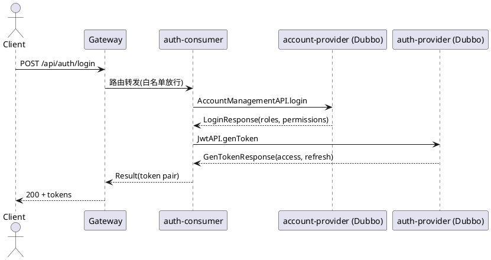

# 慢病管理 AI 平台接口文档（含业务流程）

> 文档定位：从「前端/第三方调用者」视角，说明通过 **Gateway** 访问各微服务 Consumer 的 HTTP 接口；并补充关键的 Dubbo RPC 调用链与业务流程。
>
> 代码来源：本仓库 `chronic-care-ai-platform`。

---

## 1. 总览

### 1.1 架构分层与调用约定

- **Gateway（Spring Cloud Gateway）**：统一入口，负责
  - TraceId 链路追踪（生成/透传 `X-Trace-Id`）
  - JWT 校验（Dubbo 调用 `auth-server` 的 `TokenValidationAPI`）
  - 将用户信息注入下游请求头（`X-User-Id`、`X-Username`、`X-User-Roles`、`X-User-Authorities`）
  - 白名单路径放行（登录/注册/刷新 Token/验证码等）

- **Consumer（HTTP 层）**：对外提供 REST 接口
  - 使用 `@DubboReference` 调用对应 Provider 的 Dubbo 接口
  - 返回统一 `Result<T>` 结构

- **Provider（Dubbo 层）**：承载业务与数据访问
  - 使用 `@DubboService` 暴露 RPC
  - 读写数据库/缓存/调用第三方等

- **utils 模块**：公共能力
  - `UserInfoManager`：通过 ThreadLocal 保存并读取当前请求用户信息（由拦截器/网关注入）
  - TraceId 过滤器：把请求头的 TraceId 放入 MDC
  - 权限注解：`@RequireRole` / `@RequirePermission`

> 重要：本仓库的 HTTP 控制器普遍依赖 `UserInfoManager.getUserId()` 读取当前用户；因此**必须经由 Gateway**（或在测试时自行补齐同名请求头与拦截器逻辑）。

### 1.2 鉴权与请求头规范

#### 1.2.1 网关 JWT 过滤器（关键行为）

- 位置：`gateway/src/main/java/com/zixin/gateway/config/TraceAndJwtAuthFilter.java`
- 行为：
  1. 生成/获取 TraceId（若请求头无 TraceId，则生成 UUID 去掉 `-`）
  2. 判断是否白名单路径：白名单直接放行（仍注入 TraceId）
  3. 非白名单：读取 `Authorization: Bearer <token>`
  4. Dubbo 调用 `TokenValidationAPI.validateToken` 验证 token
  5. token 合法：向下游注入请求头：
     - `X-Trace-Id`
     - `X-User-Id`
     - `X-Username`
     - `X-User-Roles`（逗号分隔）
     - `X-User-Authorities`（逗号分隔）
  6. token 不合法：返回 401

#### 1.2.2 白名单路径

> 以下路径在网关层不做 JWT 校验（用于登录/注册/验证码等）

- `/api/auth/login`
- `/api/auth/register`
- `/api/auth/refresh`
- `/api/auth/validate`
- `/api/auth/sms/code`
- `/actuator/**`、`/api/actuator/**`
- `/v3/api-docs/**`、`/swagger-ui/**`（含 `/api/` 前缀版本）
- `/error`

#### 1.2.3 通用请求头

| Header | 说明 | 产生方 |
|---|---|---|
| `Authorization` | `Bearer <accessToken>` | 客户端（非白名单必填） |
| `X-Trace-Id` | 链路追踪 ID | Gateway 生成/透传 |
| `X-User-Id` | 用户 ID | Gateway 注入 |
| `X-Username` | 用户名 | Gateway 注入 |
| `X-User-Roles` | 角色列表，逗号分隔 | Gateway 注入 |
| `X-User-Authorities` | 权限列表，逗号分隔 | Gateway 注入 |

### 1.3 统一返回结构

Consumer Controller 基本使用：`com.zixin.utils.utils.Result<T>`

通常形态（示例）：

```json
{
  "code": 200,
  "message": "success",
  "data": {}
}
```

> 说明：不同模块对 `code/message/data` 的含义保持一致，但具体字段/错误码枚举（如 `ToBCodeEnum`/`ToCCodeEnum`）需以实际响应为准。

---

## 2. 核心业务流程（端到端）

本节以“用户登录 → 访问业务接口”的真实调用链说明系统如何工作。

### 2.1 登录 / 注册 / Token 生命周期（SSO）

#### 2.1.1 登录业务流程（账号密码）

**入口**：`auth-server` 的 `auth-consumer` 提供 `/auth/login`，通常由 Gateway 路由到 `/api/auth/login`。

**业务链路**：

1. 客户端调用 `POST /api/auth/login`
2. `SSOController.login` → `SSOServiceImpl.login`
3. `SSOServiceImpl.login` Dubbo 调用：
   - `AccountManagementAPI.login`（账户校验 + 返回用户角色/权限）
4. 登录成功后 `SSOServiceImpl.login` Dubbo 调用：
   - `JwtAPI.genToken` 生成双 Token：accessToken + refreshToken
5. 返回给客户端：`userId / username / accessToken / refreshToken / tokenType`

**关键点**：
- accessToken 用于访问业务 API；refreshToken 用于刷新 accessToken。
- 网关校验 token 时走 Dubbo：`TokenValidationAPI.validateToken`。

#### 2.1.2 注册业务流程

1. 客户端调用 `POST /api/auth/register`
2. `SSOController.register` → `SSOServiceImpl.register`
3. Dubbo 调用 `AccountManagementAPI.register`
4. 返回注册结果

#### 2.1.3 短信验证码流程

1. 客户端调用 `POST /api/auth/sms/code`
2. `SSOController.sendSmsCode` → `SSOServiceImpl.sendSmsCode(phone)`
3. `SSOServiceImpl`：
   - 本地 Guava Cache 记录：验证码（5 分钟）、发送次数（1 小时）、最近发送时间（60 秒）
   - Dubbo 调用 `SMSAPI.sendSMS`
4. 返回是否发送成功

#### 2.1.4 刷新 Token / 登出

- 刷新 Token：`POST /api/auth/refresh` → Dubbo `JwtAPI.refreshToken`
- 登出：`POST /api/auth/logout` → Dubbo `TokenValidationAPI.revokeToken`（加入黑名单/撤销）

#### 2.1.5 时序图（PlantUML）



---

## 3. HTTP 接口清单（按模块）

> 说明：以下接口路径均以 Consumer Controller 上的 `@RequestMapping` 为基准；实际线上访问通常为 `Gateway` 加统一前缀（例如 `/api`），以网关路由配置为准。

### 3.1 认证中心（auth-server / auth-consumer）

**Controller**：`auth-server/auth-consumer/.../SSOController.java`

#### 3.1.1 登录

- **POST** `/auth/login`
- **鉴权**：白名单
- **请求体**：`LoginRequest`
  - `loginAccount`：账号
  - `password`：密码

#### 3.1.2 注册

- **POST** `/auth/register`
- **鉴权**：白名单
- **请求体**：`RegisterRequest`

#### 3.1.3 发送短信验证码

- **POST** `/auth/sms/code`
- **鉴权**：白名单
- **请求体**：`SendSMSRequest`
  - `phone`

#### 3.1.4 刷新 Token

- **POST** `/auth/refresh`
- **鉴权**：白名单
- **请求体**：`RefreshTokenRequest`

#### 3.1.5 校验 Token

- **POST** `/auth/validate`
- **鉴权**：白名单
- **请求体**：`ValidateTokenRequest`

#### 3.1.6 登出

- **POST** `/auth/logout`
- **鉴权**：通常需要（但当前在白名单中包含 `/api/auth/validate`，未包含 `/logout`；具体是否在网关路由白名单需核对）
- **请求体**：`ValidateTokenRequest`（包含要撤销的 token）

#### 3.1.7 更新用户信息（不允许改密码）

- **POST** `/auth/update-user`
- **鉴权**：需要 accessToken
- **请求体**：`UpdateUserInfoRequest`

#### 3.1.8 上传头像

- **POST** `/auth/upload-avatar`
- **鉴权**：需要 accessToken
- **Content-Type**：`multipart/form-data`
- **参数**：`file`
- **内部流程**：
  - 本地校验图片后缀/大小
  - Dubbo 调用 `OSSAPI.uploadFile` 上传，返回 URL

#### 3.1.9 忘记密码（通过短信验证码）

- **POST** `/auth/forgot-password`
- **鉴权**：通常应为白名单（当前网关白名单未包含该路径，需补齐路由配置才可无 token 调用）
- **请求体**：Map
  - `phone`
  - `code`
  - `newPassword`

---

### 3.2 医生工作台（doctor-service / doctor-service-consumer）

**Controller**：`doctor-service/doctor-service-consumer/.../DoctorWorkbenchController.java`

> 该模块 README 已给出较完整的 API 示例与状态流转规则，本节补充“真实鉴权/上下文”与关键流程。

#### 3.2.1 添加日程

- **POST** `/doctor/workbench/schedule/add`
- **鉴权**：`@RequireRole("DOCTOR")`
- **请求体**：`AddScheduleRequest`

#### 3.2.2 查询日程列表

- **GET** `/doctor/workbench/schedule/list`
- **鉴权**：`@RequireRole("DOCTOR")`
- **请求体**：`QueryScheduleRequest`
- **关键安全策略**：Consumer 会强制 `request.doctorId = UserInfoManager.getUserId()`，防止越权查询。

#### 3.2.3 获取日程详情

- **GET** `/doctor/workbench/schedule/detail?scheduleId=...`
- **鉴权**：`@RequireRole("DOCTOR")`
- **业务约束**：Provider 会校验 schedule 归属 doctorId。

#### 3.2.4 完成日程并上传诊断报告

- **POST** `/doctor/workbench/schedule/complete`
- **鉴权**：`@RequireRole("DOCTOR")`
- **请求体**：`CompleteScheduleRequest`
- **关键安全策略**：Consumer 强制 `request.doctorId = UserInfoManager.getUserId()`。

#### 3.2.5 取消日程

- **POST** `/doctor/workbench/schedule/cancel?scheduleId=...&reason=...`
- **鉴权**：`@RequireRole("DOCTOR")`

#### 3.2.6 更新日程状态

- **POST** `/doctor/workbench/schedule/status?scheduleId=...&status=...`
- **鉴权**：`@RequireRole("DOCTOR")`

#### 3.2.7 日程状态流转（业务规则）

- `PENDING` → `IN_PROGRESS` → `COMPLETED`
- 任意中间状态可进入 `CANCELLED`（取决于 Provider 规则）

#### 3.2.8 端到端流程（医生处理日程）

1. 医生登录获取 token
2. 调用 `/doctor/workbench/schedule/list` 获取当天日程（doctorId 由网关注入）
3. 进入某个日程详情 `/doctor/workbench/schedule/detail`
4. 处理过程中更新状态 `/doctor/workbench/schedule/status`
5. 完成后提交诊断报告 `/doctor/workbench/schedule/complete`
6. （可扩展）通过 message-system 推送通知患者（Provider 侧集成）

---

### 3.3 站内信（message-system / message-system-consumer）

**Controller**：`message-system/message-system-consumer/.../MessageController.java`

#### 3.3.1 查询收件箱

- **GET** `/message/inbox`
- **鉴权**：需要 accessToken（网关校验后注入 `X-User-Id`）
- **请求体**：`QueryMessageRequest`

#### 3.3.2 查询发件箱

- **GET** `/message/sent`
- **鉴权**：需要 accessToken
- **请求体**：`QueryMessageRequest`

#### 3.3.3 获取消息详情

- **GET** `/message/detail?messageId=...`
- **鉴权**：需要 accessToken

#### 3.3.4 标记已读

- **POST** `/message/read?messageId=...`
- **鉴权**：需要 accessToken

#### 3.3.5 批量标记已读

- **POST** `/message/batch-read`
- **鉴权**：需要 accessToken
- **请求体**：`List<Long>` messageIds

#### 3.3.6 删除消息

- **POST** `/message/delete?messageId=...`
- **鉴权**：需要 accessToken

#### 3.3.7 批量删除

- **POST** `/message/batch-delete`
- **鉴权**：需要 accessToken
- **请求体**：`List<Long>` messageIds

#### 3.3.8 获取未读数

- **GET** `/message/unread-count`
- **鉴权**：需要 accessToken

#### 3.3.9 业务流程（消息通知）

典型场景：
- AI/医生完成某项处理后 → 站内信通知患者/家属

链路：
1. 业务 Provider（如 doctor-service-provider）Dubbo 调用 `MessageAPI.pushMessage(...)`
2. message-system-provider 写入消息表
3. 患者前端调用 `/message/inbox` 拉取未读消息
4. 用户打开详情 `/message/detail` 并 `/message/read` 标记已读

---

### 3.4 健康报告中心（health-report-center / health-center-consumer）

**Controller**：`health-report-center/health-center-consumer/.../HealthReportController.java`

#### 3.4.1 上传健康报告

- **POST** `/health/report/upload`
- **鉴权**：`@RequireRole("PATIENT")`
- **Content-Type**：`multipart/form-data`
- **参数**：
  - `file`：上传文件
  - `UploadReportRequest`（作为 `@ModelAttribute`）

**支持类型**（代码注释）：
- 图片报告：`reportType=1`（需要 file）
- 文字报告：`reportType=2`（需要 textContent，当前 Controller 方法仍强制 file 入参，需注意实现一致性）
- PDF 报告：`reportType=3`（需要 file）

**内部流程**：
1. `UserInfoManager.getUserIdOrThrow()` 获取当前用户（必须经网关注入）
2. 通过 `ossClient.uploadFile(file)` 上传，获得 `fileUrl`
3. Dubbo 调用 `HealthReportAPI.uploadReport(request)` 落库
4. 返回上传结果

#### 3.4.2 查询报告列表

- **GET** `/health/report/list`
- **鉴权**：`@RequireRole("PATIENT")`
- **Query 参数**：
  - `reportType`（可选）
  - `category`（可选）
  - `status`（可选）
  - `pageNum`（默认 1）
  - `pageSize`（默认 10）

**业务规则**：patientId 强制取 `UserInfoManager.getUserIdOrThrow()`。

#### 3.4.3 获取报告详情

- **GET** `/health/report/detail?reportId=...`
- **鉴权**：`@RequireRole("PATIENT")`

#### 3.4.4 端到端流程（患者上传与查看报告）

1. 患者登录获取 token
2. 上传报告 `/health/report/upload`（网关校验 token 后注入用户信息）
3. 报告中心 Provider 落库（可能触发后续 AI 处理/医生审核等扩展）
4. 患者查询列表 `/health/report/list`
5. 查看详情 `/health/report/detail`

---

### 3.5 AI 日程能力（ai-capability-service / ai-capability-consumer）

**Controller**：`ai-capability-service/ai-capability-consumer/.../AIScheduleController.java`

#### 3.5.1 生成智能日程

- **POST** `/ai/schedule/generate`
- **鉴权**：需要 accessToken（当前 Controller 未加 `@RequireRole`，但网关非白名单仍会校验 token）
- **请求体**：`GenerateScheduleRequest`
- **处理**：Dubbo 调用 `AIScheduleAPI.SmartScheduleGenerate(request)`

---

## 4. Dubbo RPC 接口（跨服务调用点）

> 本节仅列“业务关键链路”，完整 RPC 接口请查各模块 `*-api` 工程。

### 4.1 认证相关

- `AccountManagementAPI`
  - `login(RegisterRequest/LoginRequest/...)`
  - `register(...)`
  - `updateUserInfo(...)`

- `JwtAPI`
  - `genToken(GenTokenRequest)`
  - `refreshToken(RefreshTokenRequest)`

- `TokenValidationAPI`
  - `validateToken(ValidateTokenRequest)`
  - `revokeToken(ValidateTokenRequest)`

### 4.2 医生工作台

- `DoctorWorkbenchAPI`
  - `addSchedule(AddScheduleRequest)`
  - `querySchedule(QueryScheduleRequest)`
  - `getScheduleDetail(Long scheduleId, Long doctorId)`
  - `completeSchedule(CompleteScheduleRequest)`
  - `cancelSchedule(Long scheduleId, Long doctorId, String reason)`
  - `updateScheduleStatus(Long scheduleId, Long doctorId, String status)`

### 4.3 站内信

- `MessageAPI`
  - `queryInbox/querySentBox/getMessageDetail/...`
  - `pushMessage/batchPushMessage`（供其他服务作为通知能力调用）

### 4.4 健康报告

- `HealthReportAPI`
  - `uploadReport(UploadReportRequest)`
  - `queryReportList(QueryReportListRequest)`
  - `getReportDetail(GetReportDetailRequest)`

---

## 5. 环境与启动（面向联调）

> 各微服务均通过 Nacos 加载配置与服务发现，bootstrap.properties 中可看到 Nacos 地址与 namespace。

建议启动顺序（最小可用链路）：

1. Nacos
2. Redis（认证、网关可能依赖）
3. MySQL（各业务库）
4. `auth-server`（provider + consumer）
5. `gateway`
6. 按需启动：doctor-service / message-system / health-report-center / ai-capability-service

---

## 6. 已识别的实现偏差与风险点（基于代码现状）

> 这部分是为了让“接口文档更可落地”，直接提示调用方/开发者当前实现与注释/README 的差异。

1. **health-report 上传接口入参强制 `file`**：
   - 注释声明 reportType=2（文字）不需要 file，但方法签名 `@RequestParam("file") MultipartFile file` 非可选。

2. **MessageController 使用 GET + RequestBody**：
   - `/message/inbox`、`/message/sent` 为 `@GetMapping` 却使用 `@RequestBody QueryMessageRequest`，多数 HTTP 客户端/网关对 GET body 支持不一致，联调时可能出现无法传参。

3. **Forgot password 白名单缺失**：
   - `SSOController` 有 `/auth/forgot-password`，但网关白名单未包含 `/api/auth/forgot-password`，若前端需无 token 调用，应补齐网关白名单与路由。

4. **Gateway 未在代码层展示路由规则**：
   - 本仓库 gateway 依赖 Nacos 配置中心加载路由，本文档以 Controller 的路径为基准；对外统一前缀（如 `/api`）需以 Nacos 网关路由为准。

---

## 7. 附录：接口快速检索（HTTP Controller 列表）

- `auth-server/auth-consumer`：`/auth/*`
- `doctor-service/doctor-service-consumer`：`/doctor/workbench/*`、`/doctor/leave/*`、`/doctor/report/*`
- `message-system/message-system-consumer`：`/message/*`
- `health-report-center/health-center-consumer`：`/health/report/*`
- `ai-capability-service/ai-capability-consumer`：`/ai/schedule/*`

