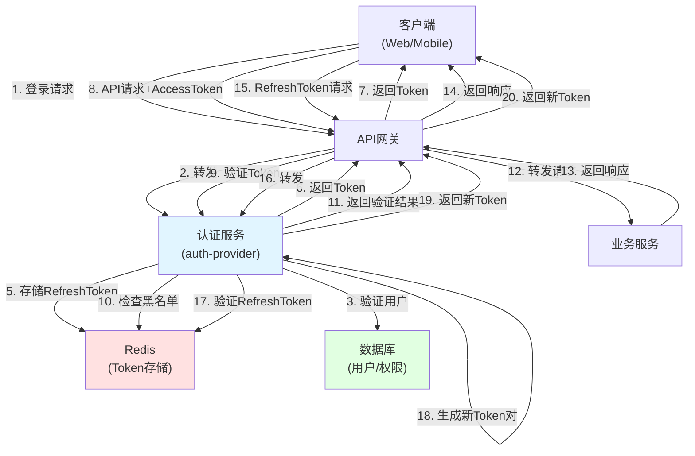
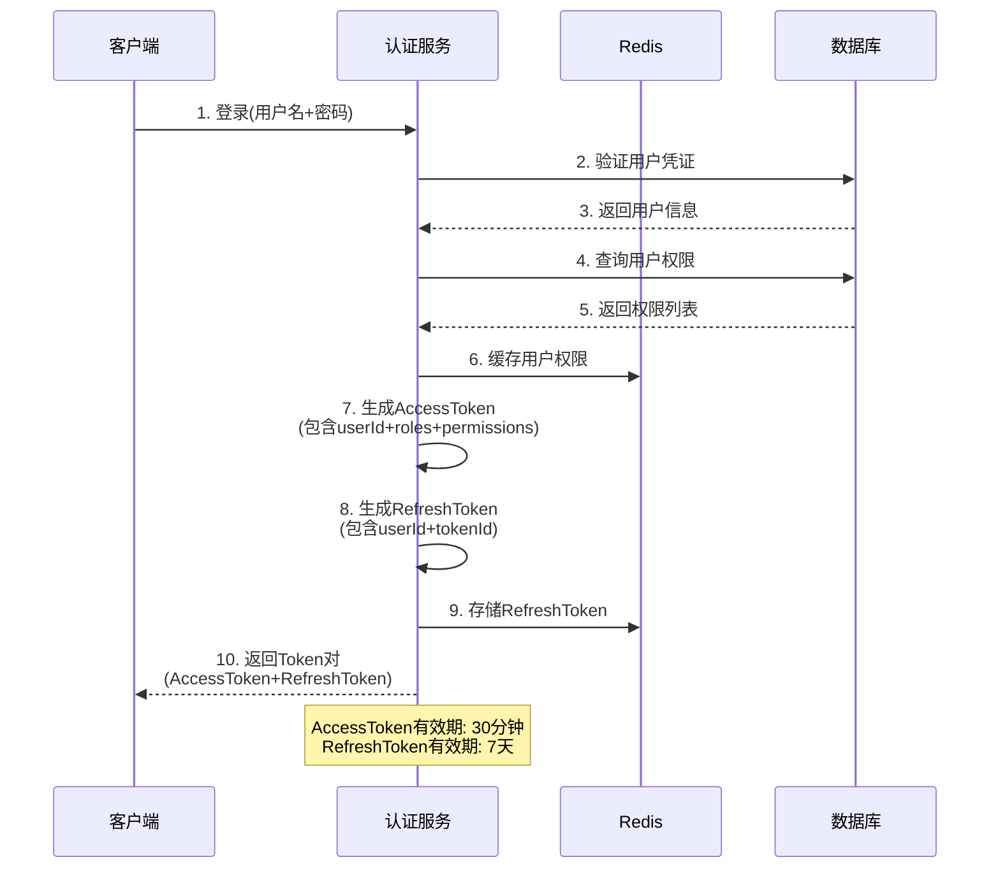
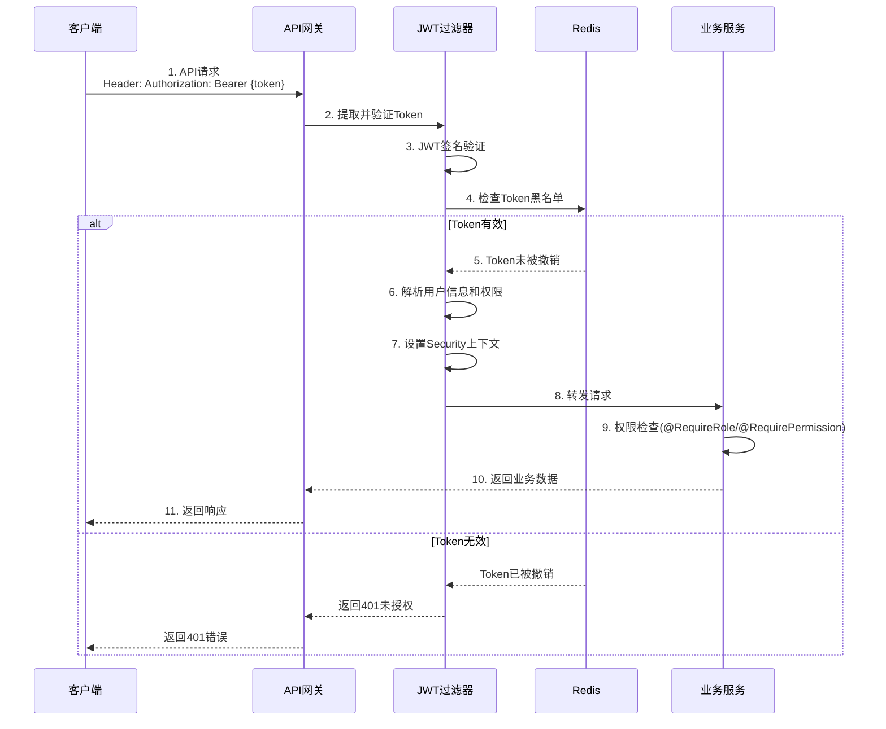
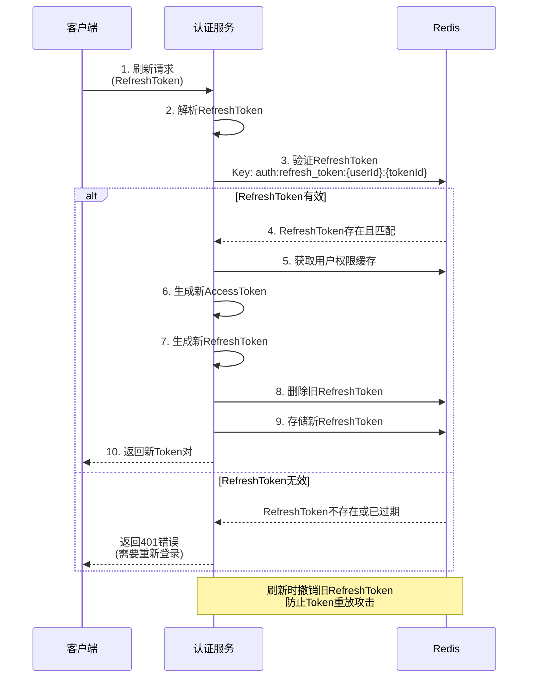
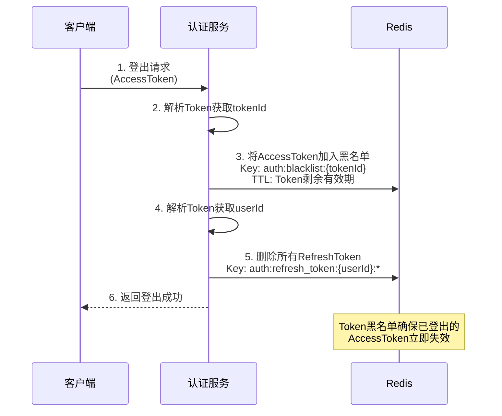
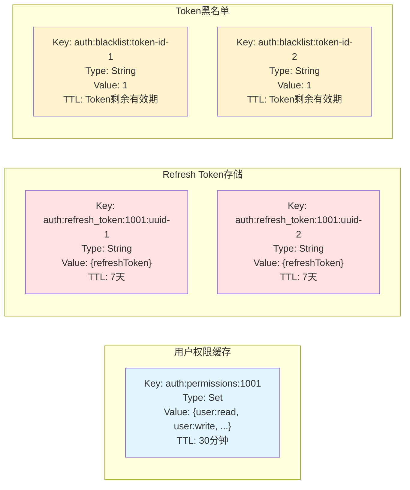

# JWT双Token认证架构

## 系统架构图



## Token生成流程



## Token验证流程



## Token刷新流程



## 登出流程



## 权限检查流程

```mermaid
graph TD
    A["请求到达"] --> B{"JWT过滤器验证"}
    B -->|无Token| C["返回401"]
    B -->|有Token| D{"Token有效?"}
    D -->|否| C
    D -->|是| E["提取用户信息和权限"]
    E --> F["设置Security上下文"]
    F --> G["到达业务方法"]
    G --> H{"有权限注解?"}
    H -->|无| I["执行业务逻辑"]
    H -->|@RequireRole| J{"检查角色"}
    H -->|@RequirePermission| K{"检查权限"}
    H -->|@PreAuthorize| L{"SpEL表达式验证"}
    J -->|通过| I
    J -->|失败| M["返回403"]
    K -->|通过| I
    K -->|失败| M
    L -->|通过| I
    L -->|失败| M
    I --> N["返回响应"]
    
    style C fill:#ffcccc
    style M fill:#ffcccc
    style N fill:#ccffcc
```

## Redis数据结构



## Token内容对比

| 字段 | Access Token | Refresh Token |
|------|-------------|---------------|
| sub (用户ID) | ✅ | ✅ |
| type (Token类型) | access | refresh |
| roles (角色) | ✅ | ❌ |
| authorities (权限) | ✅ | ❌ |
| jti (Token ID) | ✅ (可选) | ✅ (必需) |
| iat (签发时间) | ✅ | ✅ |
| exp (过期时间) | 30分钟 | 7天 |
| 存储位置 | 不存储 | Redis |
| 用途 | API访问 | 刷新Token |

## 安全特性

1. **双Token机制**
   - Access Token: 短期有效，降低泄露风险
   - Refresh Token: 长期有效，减少登录次数
   - 分离存储和验证逻辑

2. **Token黑名单**
   - 支持即时撤销Token
   - 实现登出功能
   - 防止已泄露Token被滥用

3. **Refresh Token轮换**
   - 刷新时生成新的Refresh Token
   - 撤销旧的Refresh Token
   - 防止Token重放攻击

4. **权限缓存**
   - Redis缓存用户权限
   - 减少数据库查询
   - 支持权限即时更新

5. **RSA签名**
   - 使用RSA算法签名
   - 公钥验证，私钥签名
   - 支持密钥轮换

## 核心优势

✅ **安全性高**: 双Token机制，降低泄露风险  
✅ **性能好**: 权限缓存，减少数据库查询  
✅ **可扩展**: 支持自定义权限注解和Spring Security  
✅ **易用性**: 提供完整的API和示例代码  
✅ **灵活性**: 支持角色和权限的细粒度控制  
✅ **可维护**: 代码结构清晰，注释完整
