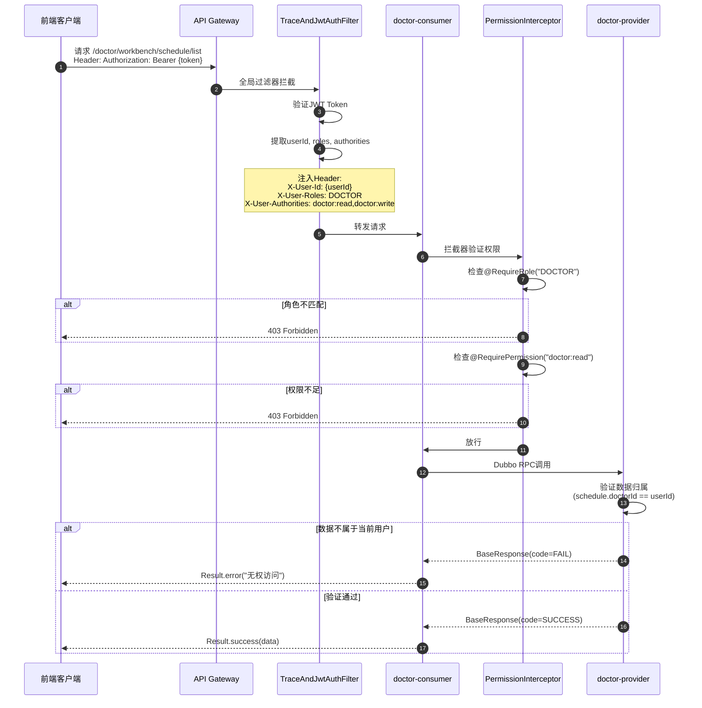

# Doctor Service 简化权限设计

## 📚 权限体系概述

### 设计原则
- ✅ **简单明了**: 只区分角色和读写权限
- ✅ **易于维护**: 减少权限码数量
- ✅ **符合直觉**: 权限命名清晰易懂

---

## 🎯 角色定义

| 角色代码 | 角色名称 | 说明 |
|---------|---------|------|
| ADMIN | 系统管理员 | 拥有所有权限 |
| DOCTOR | 医生 | 可访问医生工作台 |
| PATIENT | 患者 | 可管理个人健康信息 |

---

## 🔐 权限设计

### 权限分类
只保留两类权限:
1. **读权限 (READ)**: 查询、查看数据
2. **写权限 (WRITE)**: 创建、修改、删除数据

### 权限码定义

| 权限代码 | 权限名称 | 说明 |
|---------|---------|------|
| doctor:read | 医生读权限 | 查看医生信息、日程列表、日程详情 |
| doctor:write | 医生写权限 | 生成日程、完成日程、取消日程、更新状态 |
| patient:read | 患者读权限 | 查看患者信息、健康数据 |
| patient:write | 患者写权限 | 修改患者信息、上传健康数据 |

---

## 🛡️ 接口权限映射

### Doctor Service 接口权限

| 接口 | HTTP方法 | 角色要求 | 权限要求 | 说明 |
|-----|---------|---------|---------|------|
| `/doctor/workbench/schedule/generate` | POST | DOCTOR | doctor:write | AI生成日程 |
| `/doctor/workbench/schedule/list` | GET | DOCTOR | doctor:read | 查看日程列表 |
| `/doctor/workbench/schedule/detail` | GET | DOCTOR | doctor:read | 查看日程详情 |
| `/doctor/workbench/schedule/complete` | POST | DOCTOR | doctor:write | 完成日程 |
| `/doctor/workbench/schedule/cancel` | POST | DOCTOR | doctor:write | 取消日程 |
| `/doctor/workbench/schedule/status` | POST | DOCTOR | doctor:write | 更新日程状态 |
| `/doctor/workbench/info` | GET | DOCTOR | doctor:read | 获取医生信息 |

---

## 💻 代码实现

### 1. Controller层权限注解

```java
@RestController
@RequestMapping("/doctor/workbench")
@Slf4j
@RequireRole("DOCTOR")  // 类级别: 只有DOCTOR角色可访问
public class DoctorWorkbenchController {
    
    @DubboReference(check = false)
    private DoctorWorkbenchAPI workbenchAPI;
    
    /**
     * 查看日程列表
     * 需要: doctor:read 权限
     */
    @GetMapping("/schedule/list")
    @RequirePermission("doctor:read")
    public Result<QueryScheduleResponse> querySchedule(
            @ModelAttribute QueryScheduleRequest request,
            @RequestHeader("X-User-Id") Long userId) {
        
        request.setDoctorId(userId);
        QueryScheduleResponse response = workbenchAPI.querySchedule(request);
        
        return response.getCode() == ToBCodeEnum.SUCCESS 
            ? Result.success(response) 
            : Result.error(response.getMessage());
    }
    
    /**
     * AI生成日程建议
     * 需要: doctor:write 权限
     */
    @PostMapping("/schedule/generate")
    @RequirePermission("doctor:write")
    public Result<GenerateScheduleResponse> generateSchedule(
            @RequestBody GenerateScheduleRequest request,
            @RequestHeader("X-User-Id") Long userId) {
        
        request.setDoctorId(userId);
        GenerateScheduleResponse response = workbenchAPI.generateScheduleSuggestion(request);
        
        return response.getCode() == ToBCodeEnum.SUCCESS 
            ? Result.success(response) 
            : Result.error(response.getMessage());
    }
    
    /**
     * 完成日程
     * 需要: doctor:write 权限
     */
    @PostMapping("/schedule/complete")
    @RequirePermission("doctor:write")
    public Result<CompleteScheduleResponse> completeSchedule(
            @RequestBody CompleteScheduleRequest request,
            @RequestHeader("X-User-Id") Long userId) {
        
        request.setDoctorId(userId);
        CompleteScheduleResponse response = workbenchAPI.completeSchedule(request);
        
        return response.getCode() == ToBCodeEnum.SUCCESS 
            ? Result.success(response) 
            : Result.error(response.getMessage());
    }
}
```

### 2. Provider层业务级权限验证

Provider层只需验证**数据归属**,不需要验证权限码:

```java
@Service
@DubboService
@Slf4j
@RequiredArgsConstructor
public class DoctorWorkbenchServiceImpl implements DoctorWorkbenchAPI {
    
    private final DoctorScheduleMapper scheduleMapper;
    
    @Override
    public GetScheduleDetailResponse getScheduleDetail(Long scheduleId, Long doctorId) {
        GetScheduleDetailResponse response = new GetScheduleDetailResponse();
        
        try {
            // 1. 查询日程
            DoctorSchedule schedule = scheduleMapper.selectById(scheduleId);
            
            if (schedule == null) {
                response.setCode(ToBCodeEnum.FAIL);
                response.setMessage("日程不存在");
                return response;
            }
            
            // 2. 验证数据归属: 只能查看自己的日程
            if (!schedule.getDoctorId().equals(doctorId)) {
                log.warn("Permission denied: doctor {} tried to access schedule {} owned by doctor {}", 
                        doctorId, scheduleId, schedule.getDoctorId());
                response.setCode(ToBCodeEnum.FAIL);
                response.setMessage("无权访问该日程");
                return response;
            }
            
            // 3. 返回结果
            response.setCode(ToBCodeEnum.SUCCESS);
            response.setSchedule(convertToVO(schedule));
            
        } catch (Exception e) {
            log.error("Get schedule detail failed", e);
            response.setCode(ToBCodeEnum.FAIL);
            response.setMessage("查询失败: " + e.getMessage());
        }
        
        return response;
    }
}
```

---

## 📊 权限验证流程



---

## 🗄️ 数据库权限表设计

### 简化的权限表

```sql
-- 权限表
INSERT INTO `permission` (`permission_id`, `permission_code`, `permission_name`, `description`) VALUES
(1, 'doctor:read', '医生读权限', '查看医生信息、日程等'),
(2, 'doctor:write', '医生写权限', '创建、修改、删除医生相关数据'),
(3, 'patient:read', '患者读权限', '查看患者信息、健康数据'),
(4, 'patient:write', '患者写权限', '修改患者信息、上传健康数据'),
(5, 'admin:all', '管理员全部权限', '系统管理员拥有所有权限');

-- 角色权限关联
INSERT INTO `role_permission` (`role_id`, `permission_id`) VALUES
-- ADMIN拥有所有权限
(1, 1), (1, 2), (1, 3), (1, 4), (1, 5),
-- DOCTOR拥有医生读写权限
(2, 1), (2, 2),
-- PATIENT拥有患者读写权限
(3, 3), (3, 4);
```

---

## 🎯 权限验证规则

### 两层验证机制

```
第1层: Gateway + Consumer
    ↓
验证角色(@RequireRole) + 验证权限(@RequirePermission)
    ↓
第2层: Provider
    ↓
验证数据归属(只能操作自己的数据)
```

### 验证逻辑

#### ✅ Gateway层
- **职责**: Token验证、提取用户信息
- **失败返回**: 401 Unauthorized

#### ✅ Consumer层 (PermissionInterceptor)
- **职责**: 验证`@RequireRole`和`@RequirePermission`
- **失败返回**: 403 Forbidden

#### ✅ Provider层
- **职责**: 验证数据归属
- **失败返回**: BaseResponse(code=FAIL, message="无权访问")

---

## 📝 权限注解使用规范

### 1. 只读接口
```java
@GetMapping("/info")
@RequirePermission("doctor:read")
public Result<DoctorVO> getDoctorInfo(@RequestHeader("X-User-Id") Long userId) {
    // 查询医生信息
}
```

### 2. 写操作接口
```java
@PostMapping("/schedule/complete")
@RequirePermission("doctor:write")
public Result completeSchedule(
        @RequestBody CompleteScheduleRequest request,
        @RequestHeader("X-User-Id") Long userId) {
    // 完成日程
}
```

### 3. 多角色访问
```java
@GetMapping("/public/doctor/list")
@RequireRole({"DOCTOR", "PATIENT", "ADMIN"})
@RequirePermission("doctor:read")
public Result<List<DoctorVO>> listDoctors() {
    // 患者也可以查看医生列表
}
```

---

## ⚠️ 安全注意事项

### 1. 必须从Header获取用户ID
```java
// ❌ 错误: 信任请求参数
@GetMapping("/schedule/list")
public Result querySchedule(@RequestParam Long doctorId) {
    // 用户可以伪造doctorId
}

// ✅ 正确: 从Gateway注入的Header获取
@GetMapping("/schedule/list")
public Result querySchedule(@RequestHeader("X-User-Id") Long userId) {
    // 使用经过验证的userId
}
```

### 2. Provider层必须验证数据归属
```java
// ✅ 验证日程归属
if (!schedule.getDoctorId().equals(currentDoctorId)) {
    return error("无权访问该日程");
}
```

### 3. 写操作使用乐观锁
```java
// ✅ 防止并发冲突
wrapper.eq(DoctorSchedule::getVersion, schedule.getVersion())
       .set(DoctorSchedule::getStatus, newStatus);
```

---

## 📊 权限对比

### 简化前 vs 简化后

| 对比项 | 简化前 | 简化后 |
|-------|-------|-------|
| 权限码数量 | 10+ | 4 |
| 权限命名 | SCHEDULE_MANAGEMENT, DIAGNOSIS_RECORD | doctor:read, doctor:write |
| 验证层级 | 3层 | 2层 |
| 维护成本 | 高 | 低 |
| 学习成本 | 高 | 低 |

### 优势
- ✅ **简单直观**: 权限命名清晰,一看就懂
- ✅ **易于维护**: 权限码少,减少配置错误
- ✅ **符合直觉**: 读写分离,符合常规认知
- ✅ **扩展性好**: 新增模块只需添加 `module:read` 和 `module:write`

---

## 🚀 总结

### 简化后的权限体系
```
用户登录
  ↓
JWT包含: userId, roles, authorities
  ↓
Gateway验证Token
  ↓
注入Header: X-User-Id, X-User-Roles, X-User-Authorities
  ↓
Consumer验证: @RequireRole + @RequirePermission
  ↓
Provider验证: 数据归属
  ↓
执行业务逻辑
```

### 核心原则
1. **角色控制访问范围**: DOCTOR访问医生模块, PATIENT访问患者模块
2. **权限控制操作类型**: read查看, write修改
3. **数据归属控制数据**: 只能操作自己的数据

这样的设计既保证了安全性,又大大降低了复杂度! 🎉
