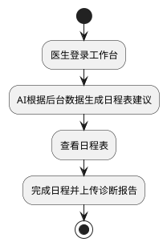

# 医生工作台微服务 (Doctor Service)

## 📚 模块架构

```
doctor-service/
├── doctor-service-api/          # API定义层
│   ├── DoctorWorkbenchAPI.java # Dubbo服务接口
│   ├── dto/                    # 数据传输对象
│   ├── po/                     # 持久化对象
│   │   ├── Doctor.java         # 医生信息
│   │   ├── DoctorSchedule.java # 医生日程
│   │   └── ScheduleCategory.java # 日程类别
│   └── enums/                  # 枚举类
│       ├── ScheduleStatus.java # 日程状态
│       └── SchedulePriority.java # 优先级
├── doctor-service-provider/     # 服务提供者 (Dubbo RPC)
│   ├── service/                # Dubbo服务实现
│   │   └── DoctorWorkbenchServiceImpl.java
│   └── mapper/                 # 数据访问层
└── doctor-service-consumer/     # 服务消费者 (C端接口)
    └── controller/             # C端HTTP接口
        └── DoctorWorkbenchController.java
```

## 🎯 业务流程



## 📊 数据模型

### 1. 医生信息表 (doctor)
```sql
- id: 医生ID
- user_id: 用户ID（关联account表）
- department: 科室
- title: 职称（主治医师、主任医师等）
- experience: 工作经验（年）
- certification_number: 执业证书编号
- education: 学历
- bio: 简介
- create_time: 创建时间
- update_time: 更新时间
- dele: 逻辑删除标记
- version: 乐观锁版本号
- ext: 扩展字段（JSON）
```

### 2. 医生日程表 (doctor_schedule)
```sql
- id: 日程ID
- doctor_id: 医生ID
- patient_id: 患者ID
- schedule: 日程内容
- schedule_category: 日程类别ID
- schedule_day: 日程日期（YYYY-MM-DD）
- priority: 优先级（1-低, 2-中, 3-高, 4-紧急）
- status: 状态（PENDING, IN_PROGRESS, COMPLETED, CANCELLED）
- result: 执行结果/诊断报告
- create_time: 创建时间
- update_time: 更新时间
- version: 乐观锁版本号
- ext: 扩展字段（JSON）
```

### 3. 日程类别表 (schedule_category)
```sql
- id: 类别ID
- category_name: 类别名称（门诊、手术、查房、会诊等）
- category_alias: 类别别名
- describe: 类别描述
- ext: 扩展字段（JSON）
```

## 🔌 API接口

### Dubbo RPC接口 (Provider提供)

```java
public interface DoctorWorkbenchAPI {
    // AI生成日程建议
    GenerateScheduleResponse generateScheduleSuggestion(GenerateScheduleRequest request);
    
    // 查询医生日程
    QueryScheduleResponse querySchedule(QueryScheduleRequest request);
    
    // 获取日程详情
    ScheduleVO getScheduleDetail(Long scheduleId, Long doctorId);
    
    // 完成日程并上传诊断报告
    CompleteScheduleResponse completeSchedule(CompleteScheduleRequest request);
    
    // 取消日程
    BaseResponse cancelSchedule(Long scheduleId, Long doctorId, String reason);
    
    // 更新日程状态
    BaseResponse updateScheduleStatus(Long scheduleId, Long doctorId, String status);
    
    // 获取医生信息
    DoctorVO getDoctorInfo(Long doctorId);
}
```

### HTTP接口 (Consumer - 8086)

#### 1. AI生成日程建议
```bash
POST /doctor/workbench/schedule/generate
Content-Type: application/json

{
    "doctorId": 1,
    "scheduleDay": "2024-01-15",
    "department": "心血管内科"
}

Response (Result包装):
{
    "code": 200,
    "message": "success",
    "data": {
        "recommendedSchedules": [...],
        "recommendation": "根据历史数据分析，为您推荐了以下日程安排"
    }
}
```

#### 2. 查看日程表
```bash
GET /doctor/workbench/schedule/list?doctorId=1&scheduleDay=2024-01-15&status=PENDING

Response (Result包装):
{
    "code": 200,
    "message": "success",
    "data": {
        "schedules": [
            {
                "id": 1,
                "doctorId": 1,
                "patientId": 2001,
                "schedule": "复诊患者李先生",
                "scheduleDay": "2024-01-15",
                "priority": 2,
                "status": "PENDING",
                ...
            }
        ],
        "total": 10
    }
}
```

#### 3. 获取日程详情
```bash
GET /doctor/workbench/schedule/detail?scheduleId=1&doctorId=1

Response (Result包装):
{
    "code": 200,
    "message": "success",
    "data": {
        "id": 1,
        "schedule": "复诊患者李先生",
        "patientName": "李先生",
        "status": "PENDING",
        ...
    }
}
```

#### 4. 完成日程并上传诊断报告
```bash
POST /doctor/workbench/schedule/complete
Content-Type: application/json

{
    "scheduleId": 1,
    "doctorId": 1,
    "diagnosisReport": "患者血压控制良好，继续服药",
    "prescription": "缬沙坦 80mg 日1次",
    "notes": "两周后复诊"
}

Response (Result包装):
{
    "code": 200,
    "message": "success",
    "data": {
        "success": true,
        "schedule": {
            "id": 1,
            "status": "COMPLETED",
            "result": "诊断报告: 患者血压控制良好...",
            ...
        }
    }
}
```

#### 5. 取消日程
```bash
POST /doctor/workbench/schedule/cancel?scheduleId=1&doctorId=1&reason=患者临时有事

Response (Result包装):
{
    "code": 200,
    "message": "success",
    "data": true
}
```

#### 6. 更新日程状态
```bash
POST /doctor/workbench/schedule/status?scheduleId=1&doctorId=1&status=IN_PROGRESS

Response (Result包装):
{
    "code": 200,
    "message": "success",
    "data": true
}
```

## 🎯 核心功能

### 1. **AI日程推荐** (待实现)
```java
// 当前使用模拟数据，后续接入AI服务
@Override
public GenerateScheduleResponse generateScheduleSuggestion(GenerateScheduleRequest request) {
    // TODO: 接入AI服务
    // 1. 分析医生历史数据
    // 2. 分析患者预约情况
    // 3. 考虑科室资源分配
    // 4. 智能推荐日程安排
    
    return response;
}
```

### 2. **日程状态流转**
```
PENDING (待处理)
    ↓
IN_PROGRESS (进行中)
    ↓
COMPLETED (已完成) / CANCELLED (已取消)
```

### 3. **优先级管理**
- **紧急 (4)**: 急诊、紧急手术
- **高 (3)**: 重要会诊、复杂病例
- **中 (2)**: 常规门诊、查房
- **低 (1)**: 行政事务、教学

## 🔐 权限控制

### Consumer接口权限
```java
@RequireRole("DOCTOR")  // 只有DOCTOR角色可以访问
public class DoctorWorkbenchController {
    // 所有接口只对医生开放
}
```

## 🚀 启动顺序

### 1. 初始化数据库
```bash
mysql -u root -p < doctor-service/init.sql
```

### 2. 启动Provider (Dubbo服务)
```bash
cd doctor-service/doctor-service-provider
mvn spring-boot:run
```
- 端口: 8085 (HTTP), 20885 (Dubbo)
- 注册到Nacos
- 提供Dubbo服务

### 3. 启动Consumer (HTTP接口)
```bash
cd doctor-service/doctor-service-consumer
mvn spring-boot:run
```
- 端口: 8086 (HTTP)
- 注册到Nacos
- 调用Provider的Dubbo服务

## 📊 数据库

- **数据库名**: `chronic_care_doctor`
- **表**: `doctor`, `doctor_schedule`, `schedule_category`
- **初始化脚本**: `init.sql`

## 💡 扩展功能

### 1. **与Account集成**
```java
// 获取医生的用户基础信息
@DubboReference
private AccountAPI accountAPI;

public DoctorVO getDoctorInfo(Long doctorId) {
    Doctor doctor = doctorMapper.selectById(doctorId);
    Account user = accountAPI.getAccount(doctor.getUserId());
    
    // 合并信息
    vo.setName(user.getName());
    vo.setPhone(user.getPhone());
    ...
}
```

### 2. **AI日程推荐**
```java
// 接入AI服务
@DubboReference
private AIRecommendationAPI aiAPI;

public GenerateScheduleResponse generateScheduleSuggestion(GenerateScheduleRequest request) {
    // 调用AI服务生成推荐
    AIRecommendationResponse aiResponse = aiAPI.recommendSchedule(request);
    return aiResponse;
}
```

### 3. **消息通知**
```java
// 日程变更通知患者
@DubboReference
private MessageAPI messageAPI;

public void notifyPatient(Long patientId, String message) {
    PushMessageRequest request = new PushMessageRequest();
    request.setReceiverId(patientId);
    request.setTitle("日程通知");
    request.setContent(message);
    
    messageAPI.pushMessage(request);
}
```

## ✅ 核心特性

✅ **纯Dubbo服务**: Provider只提供RPC接口  
✅ **分层架构**: Provider(Dubbo) + Consumer(HTTP)  
✅ **AI推荐**: 支持AI生成日程建议（待接入）  
✅ **日程管理**: 完整的日程CRUD和状态流转  
✅ **诊断报告**: 支持完成日程时上传诊断结果  
✅ **优先级**: 支持4级优先级管理  
✅ **权限控制**: 使用@RequireRole限制访问  
✅ **账户集成**: 继承Account的用户信息  
✅ **扩展性**: 预留AI、消息等服务接口  

## 🎯 后续优化

1. **接入AI服务**: 实现智能日程推荐
2. **对接Account**: 获取医生和患者的基础信息
3. **消息通知**: 日程变更时通知患者
4. **统计分析**: 医生工作量统计、效率分析
5. **日历视图**: 提供日历形式的日程展示
6. **批量操作**: 支持批量创建、更新日程
