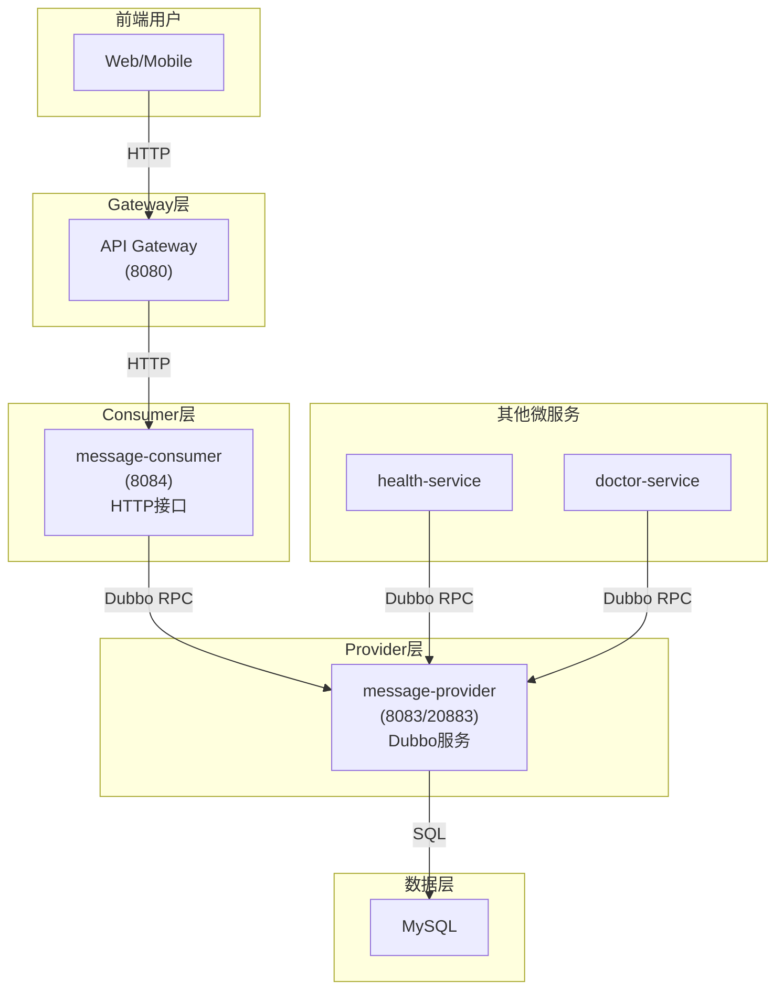

# Message System - 站内信系统完整指南

## 📚 系统架构

### 分层设计

```
message-system/
├── message-system-api/          # API定义层
│   ├── api/MessageAPI.java      # Dubbo服务接口定义
│   ├── dto/                     # 数据传输对象 (Request/Response)
│   ├── po/                      # 持久化对象 (Entity)
│   ├── vo/                      # 视图对象
│   └── enums/                   # 枚举类型
├── message-system-provider/     # 服务提供者 (Dubbo RPC)
│   ├── service/                 # 业务逻辑实现
│   │   ├── MessageServiceImpl.java        (@DubboService)
│   │   └── MessageTemplateService.java    (模板服务)
│   ├── mapper/                  # 数据访问层 (MyBatis-Plus)
│   └── resources/
│       ├── application.yml      # Provider配置
│       └── db/schema.sql        # 数据库表结构
└── message-system-consumer/     # 服务消费者 (HTTP接口)
    ├── controller/              # C端HTTP接口
    │   └── MessageController.java
    └── resources/
        └── application.yml      # Consumer配置
```

---

## 🎯 核心设计原则

### 1. **Provider层设计** (纯Dubbo RPC服务)

#### 特点
- ✅ **不暴露HTTP接口**: 只提供Dubbo RPC服务
- ✅ **端口**: 8083 (HTTP), 20883 (Dubbo)
- ✅ **返回类型**: `BaseResponse`及其子类
- ✅ **注解**: `@DubboService`
- ✅ **调用方**: Consumer或其他微服务

#### 核心服务实现
```java
@Service
@DubboService  // 暴露Dubbo服务
@Slf4j
@RequiredArgsConstructor
public class MessageServiceImpl implements MessageAPI {
    
    private final MessageMapper messageMapper;
    private final MessageRecipientMapper messageRecipientMapper;
    private final MessageTemplateService templateService;
    
    @Override
    @Transactional(rollbackFor = Exception.class)
    public PushMessageResponse pushMessage(PushMessageRequest request) {
        // 系统推送消息逻辑
        // 返回BaseResponse子类
    }
}
```

### 2. **Consumer层设计** (C端HTTP接口)

#### 特点
- ✅ **端口**: 8084 (HTTP)
- ✅ **返回类型**: `Result<T>` (统一前端返回格式)
- ✅ **调用方式**: 通过`@DubboReference`调用Provider
- ✅ **用户认证**: 从Gateway注入的`X-User-Id`获取用户信息

#### HTTP Controller示例
```java
@RestController
@RequestMapping("/message")
@Slf4j
@RequiredArgsConstructor
public class MessageController {
    
    @DubboReference(check = false)
    private MessageAPI messageAPI;
    
    @GetMapping("/inbox")
    public Result<QueryMessageResponse> queryInbox(
            @ModelAttribute QueryMessageRequest request,
            @RequestHeader("X-User-Id") Long userId) {
        
        QueryMessageResponse response = messageAPI.queryInbox(userId, request);
        
        if (response.getCode().name().equals("SUCCESS")) {
            return Result.success(response);
        } else {
            return Result.error(response.getMessage());
        }
    }
}
```

---

## 📦 数据库设计

### 1. 消息主表 (message)

```sql
CREATE TABLE `message` (
    `message_id` BIGINT NOT NULL AUTO_INCREMENT COMMENT '消息ID',
    `message_type` INT NOT NULL DEFAULT 1 COMMENT '消息类型',
    `sender_id` BIGINT DEFAULT 0 COMMENT '发送者ID (0表示系统)',
    `sender_name` VARCHAR(50) COMMENT '发送者姓名',
    `receiver_id` BIGINT COMMENT '接收者ID',
    `title` VARCHAR(200) NOT NULL COMMENT '消息标题',
    `content` TEXT COMMENT '消息内容',
    `status` INT NOT NULL DEFAULT 1 COMMENT '消息状态',
    `is_broadcast` TINYINT NOT NULL DEFAULT 0 COMMENT '是否群发',
    `create_time` DATETIME NOT NULL DEFAULT CURRENT_TIMESTAMP,
    `update_time` DATETIME NOT NULL DEFAULT CURRENT_TIMESTAMP ON UPDATE CURRENT_TIMESTAMP,
    `read_time` DATETIME COMMENT '阅读时间',
    `revoke_time` DATETIME COMMENT '撤回时间',
    PRIMARY KEY (`message_id`),
    INDEX `idx_sender_id` (`sender_id`),
    INDEX `idx_receiver_id` (`receiver_id`),
    INDEX `idx_status` (`status`)
) ENGINE=InnoDB DEFAULT CHARSET=utf8mb4 COMMENT='消息主表';
```

### 2. 消息接收者关联表 (message_recipient)

用于群发消息的接收者管理

```sql
CREATE TABLE `message_recipient` (
    `recipient_id` BIGINT NOT NULL AUTO_INCREMENT,
    `message_id` BIGINT NOT NULL COMMENT '消息ID',
    `receiver_id` BIGINT NOT NULL COMMENT '接收者ID',
    `status` INT NOT NULL DEFAULT 1 COMMENT '消息状态',
    `create_time` DATETIME NOT NULL DEFAULT CURRENT_TIMESTAMP,
    `update_time` DATETIME NOT NULL DEFAULT CURRENT_TIMESTAMP ON UPDATE CURRENT_TIMESTAMP,
    `read_time` DATETIME COMMENT '阅读时间',
    PRIMARY KEY (`recipient_id`),
    UNIQUE KEY `uk_message_receiver` (`message_id`, `receiver_id`),
    INDEX `idx_receiver_id` (`receiver_id`)
) ENGINE=InnoDB DEFAULT CHARSET=utf8mb4;
```

### 3. 消息模板表 (message_template)

支持预定义消息模板,提高消息发送效率

```sql
CREATE TABLE `message_template` (
    `template_id` BIGINT NOT NULL AUTO_INCREMENT,
    `template_code` VARCHAR(50) NOT NULL UNIQUE COMMENT '模板编码',
    `template_name` VARCHAR(100) NOT NULL COMMENT '模板名称',
    `message_type` INT NOT NULL DEFAULT 1,
    `title_template` VARCHAR(200) NOT NULL COMMENT '标题模板',
    `content_template` TEXT NOT NULL COMMENT '内容模板',
    `params` VARCHAR(500) COMMENT '参数列表(JSON)',
    `is_enabled` TINYINT NOT NULL DEFAULT 1,
    `remark` VARCHAR(500) COMMENT '备注',
    `create_time` DATETIME NOT NULL DEFAULT CURRENT_TIMESTAMP,
    `update_time` DATETIME NOT NULL DEFAULT CURRENT_TIMESTAMP ON UPDATE CURRENT_TIMESTAMP,
    PRIMARY KEY (`template_id`)
) ENGINE=InnoDB DEFAULT CHARSET=utf8mb4;
```

---

## 🔌 API接口文档

### Dubbo RPC接口 (Provider提供)

Provider通过Dubbo RPC暴露服务,不提供HTTP接口。

#### 1. 推送单条消息 (B端接口)

```java
/**
 * 系统主动推送消息给单个用户
 * 用于其他微服务调用
 */
PushMessageResponse pushMessage(PushMessageRequest request);
```

**请求参数**:
```java
PushMessageRequest {
    Integer messageType;   // 消息类型: 1-系统 2-个人 3-群发
    Long receiverId;       // 接收者ID
    String title;          // 消息标题
    String content;        // 消息内容
}
```

**响应**:
```java
PushMessageResponse {
    ToBCodeEnum code;      // SUCCESS/FAIL
    String message;        // 提示信息
    Long messageId;        // 消息ID
    Boolean success;       // 是否成功
}
```

#### 2. 批量推送消息 (B端接口)

```java
/**
 * 批量推送消息给多个用户
 */
BatchPushMessageResponse batchPushMessage(BatchPushMessageRequest request);
```

**请求参数**:
```java
BatchPushMessageRequest {
    Integer messageType;        // 消息类型
    List<Long> receiverIds;     // 接收者ID列表
    String title;               // 消息标题
    String content;             // 消息内容
}
```

**响应**:
```java
BatchPushMessageResponse {
    ToBCodeEnum code;
    String message;
    Long messageId;                   // 群发消息ID
    Integer successCount;             // 成功数量
    List<Long> failedReceiverIds;     // 失败的接收者ID列表
}
```

#### 3. 查询收件箱

```java
QueryMessageResponse queryInbox(Long userId, QueryMessageRequest request);
```

#### 4. 标记已读

```java
MarkAsReadResponse markAsRead(Long userId, Long messageId);
```

#### 5. 撤回消息

```java
RevokeMessageResponse revokeMessage(Long userId, Long messageId);
```

**撤回规则**:
- ✅ 只有发送者可以撤回
- ✅ 发送后5分钟内有效
- ✅ 撤回后所有接收者都无法查看

---

### HTTP接口 (Consumer - 8084)

Consumer提供给前端的RESTful API,返回`Result<T>`格式。

#### 1. 查询收件箱

**接口**: `GET /message/inbox`

**请求头**: `X-User-Id: {userId}` (由Gateway注入)

**查询参数**:
| 参数 | 类型 | 必填 | 说明 |
|------|------|------|------|
| messageType | Integer | 否 | 消息类型筛选 |
| unreadOnly | Boolean | 否 | 只查询未读消息 |
| status | Integer | 否 | 消息状态筛选 |

**响应示例**:
```json
{
    "code": 200,
    "message": "success",
    "data": {
        "code": "SUCCESS",
        "message": "查询收件箱成功",
        "messages": [
            {
                "messageId": 123,
                "messageType": 1,
                "messageTypeDesc": "系统消息",
                "senderName": "系统",
                "title": "健康预警通知",
                "content": "您的血糖数值异常...",
                "status": 1,
                "statusDesc": "未读",
                "createTime": "2024-01-15 10:30:00"
            }
        ],
        "total": 10
    }
}
```

#### 2. 获取消息详情

**接口**: `GET /message/detail?messageId={messageId}`

**请求头**: `X-User-Id: {userId}`

**响应示例**:
```json
{
    "code": 200,
    "message": "success",
    "data": {
        "messageId": 123,
        "title": "健康预警通知",
        "content": "尊敬的张三，您的血糖数值为8.5mmol/L，偏高。建议：请注意饮食控制，减少糖分摄入。",
        "senderName": "系统",
        "createTime": "2024-01-15 10:30:00",
        "readTime": null,
        "status": 1
    }
}
```

#### 3. 标记已读

**接口**: `POST /message/read?messageId={messageId}`

**请求头**: `X-User-Id: {userId}`

**响应**:
```json
{
    "code": 200,
    "message": "success",
    "data": true
}
```

#### 4. 批量标记已读

**接口**: `POST /message/batch-read`

**请求头**: `X-User-Id: {userId}`

**请求体**:
```json
[123, 124, 125]
```

#### 5. 删除消息 (软删除)

**接口**: `POST /message/delete?messageId={messageId}`

**请求头**: `X-User-Id: {userId}`

#### 6. 批量删除

**接口**: `POST /message/batch-delete`

**请求体**:
```json
[123, 124, 125]
```

#### 7. 获取未读数量

**接口**: `GET /message/unread-count`

**请求头**: `X-User-Id: {userId}`

**响应**:
```json
{
    "code": 200,
    "message": "success",
    "data": 5
}
```

---

## 💻 使用示例

### 场景1: 其他微服务推送消息 (Dubbo RPC调用)

```java
/**
 * 健康数据异常预警推送
 * 在health-service中检测到异常数据时调用
 */
@Service
@Slf4j
public class HealthAlertService {
    
    @DubboReference(check = false)
    private MessageAPI messageAPI;
    
    public void sendHealthAlert(Long userId, String indicator, Double value) {
        // 构造推送请求
        PushMessageRequest request = new PushMessageRequest();
        request.setMessageType(MessageType.SYSTEM.getCode());
        request.setReceiverId(userId);
        request.setTitle("健康预警：" + indicator + "异常");
        request.setContent(String.format(
            "您的%s数值为%.2f，超出正常范围。建议尽快就医检查。", 
            indicator, value
        ));
        
        // 调用Dubbo服务推送消息
        PushMessageResponse response = messageAPI.pushMessage(request);
        
        if (response.getCode() == ToBCodeEnum.SUCCESS) {
            log.info("健康预警推送成功, messageId: {}", response.getMessageId());
        } else {
            log.error("健康预警推送失败: {}", response.getMessage());
        }
    }
}
```

### 场景2: 使用消息模板推送

```java
@Service
@Slf4j
@RequiredArgsConstructor
public class TemplateMessageService {
    
    @DubboReference(check = false)
    private MessageAPI messageAPI;
    
    private final MessageTemplateService templateService;
    
    /**
     * 使用模板发送健康预警
     */
    public void sendHealthAlertByTemplate(Long userId, String userName, 
                                          String indicator, String value, 
                                          String alertLevel, String suggestion) {
        // 1. 获取模板
        MessageTemplate template = templateService.getTemplateByCode("HEALTH_ALERT");
        if (template == null) {
            log.error("Template HEALTH_ALERT not found");
            return;
        }
        
        // 2. 准备参数
        Map<String, String> params = new HashMap<>();
        params.put("userName", userName);
        params.put("indicator", indicator);
        params.put("value", value);
        params.put("alertLevel", alertLevel);
        params.put("suggestion", suggestion);
        
        // 3. 渲染模板
        String title = templateService.renderTitle(template, params);
        String content = templateService.renderContent(template, params);
        
        // 4. 推送消息
        PushMessageRequest request = new PushMessageRequest();
        request.setMessageType(template.getMessageType());
        request.setReceiverId(userId);
        request.setTitle(title);
        request.setContent(content);
        
        messageAPI.pushMessage(request);
    }
}
```

### 场景3: 批量推送消息

```java
@Service
@Slf4j
public class BatchNotificationService {
    
    @DubboReference(check = false)
    private MessageAPI messageAPI;
    
    /**
     * 批量推送系统公告
     */
    public void broadcastAnnouncement(List<Long> userIds, String title, String content) {
        BatchPushMessageRequest request = new BatchPushMessageRequest();
        request.setMessageType(MessageType.BROADCAST.getCode());
        request.setReceiverIds(userIds);
        request.setTitle(title);
        request.setContent(content);
        
        BatchPushMessageResponse response = messageAPI.batchPushMessage(request);
        
        log.info("批量推送完成, 成功: {}, 失败: {}", 
                response.getSuccessCount(), 
                response.getFailedReceiverIds().size());
    }
}
```

### 场景4: 前端查询收件箱

```javascript
// 前端调用Consumer的HTTP接口
async function fetchInbox() {
    const response = await fetch('/message/inbox?unreadOnly=true', {
        method: 'GET',
        headers: {
            'Authorization': 'Bearer ' + accessToken,
            // Gateway会自动注入X-User-Id
        }
    });
    
    const result = await response.json();
    
    if (result.code === 200) {
        console.log('收件箱消息:', result.data.messages);
        console.log('未读消息数:', result.data.total);
    }
}
```

### 场景5: 前端标记已读

```javascript
async function markAsRead(messageId) {
    const response = await fetch(`/message/read?messageId=${messageId}`, {
        method: 'POST',
        headers: {
            'Authorization': 'Bearer ' + accessToken
        }
    });
    
    const result = await response.json();
    
    if (result.code === 200 && result.data === true) {
        console.log('标记已读成功');
    }
}
```

---

## 🚀 启动配置

### Provider配置 (application.yml)

```yaml
server:
  port: 8083

spring:
  application:
    name: message-provider
    
  datasource:
    url: jdbc:mysql://localhost:3306/chronic_care_platform?useUnicode=true&characterEncoding=utf8
    username: root
    password: your_password
    driver-class-name: com.mysql.cj.jdbc.Driver

# Dubbo配置
dubbo:
  application:
    name: message-provider
  registry:
    address: nacos://192.168.35.128:8848
    parameters:
      namespace: 48126882-0e93-4746-b265-ab232bf8d85e
      group: DEV_GROUP
  protocol:
    name: dubbo
    port: 20883
  provider:
    timeout: 3000
```

### Consumer配置 (application.yml)

```yaml
server:
  port: 8084

spring:
  application:
    name: message-consumer

# Dubbo配置
dubbo:
  application:
    name: message-consumer
  registry:
    address: nacos://192.168.35.128:8848
    parameters:
      namespace: 48126882-0e93-4746-b265-ab232bf8d85e
      group: DEV_GROUP
  consumer:
    check: false
    timeout: 3000
```

### Gateway路由配置

```yaml
spring:
  cloud:
    gateway:
      routes:
        # 站内信服务路由
        - id: message-service
          uri: lb://message-consumer    # 路由到Consumer
          predicates:
            - Path=/message/**
          filters:
            - StripPrefix=0
```

---

## 🎯 核心特性总结

### ✅ 架构特性
- **纯Dubbo服务**: Provider只提供RPC接口,不暴露HTTP
- **分层架构**: Provider(Dubbo RPC) + Consumer(HTTP)
- **统一返回**: Provider用BaseResponse, Consumer用Result
- **微服务友好**: 其他服务通过Dubbo调用Provider

### ✅ 业务特性
- **批量操作**: 支持批量推送、批量已读、批量删除
- **消息撤回**: 5分钟内可撤回
- **软删除**: 数据不丢失,保证可审计
- **不可修改**: 保证消息完整性和可追溯性
- **系统推送**: 支持系统主动推送消息
- **群发支持**: 支持向多个用户发送消息

### ✅ 扩展特性
- **消息模板**: 支持预定义模板,提高效率
- **参数化消息**: 模板支持占位符替换
- **状态管理**: 完整的消息状态流转
- **权限控制**: 只有发送者/接收者可查看

---

## 📐 调用流程图



---

## ⚠️ 注意事项

### 1. 消息删除
- 用户删除操作是**软删除**,不会真正删除数据
- 系统管理员可以看到所有已删除的消息
- 保证消息可追溯和审计

### 2. 消息撤回
- 只有**发送者**可以撤回消息
- 撤回时间限制: **5分钟**
- 撤回后所有接收者都无法查看

### 3. 群发消息
- 群发消息的接收者独立维护状态
- 每个接收者的已读/删除状态互不影响
- 通过`message_recipient`表管理

### 4. 性能优化建议
- 对高频查询字段建立索引
- 定期归档历史消息
- 使用Redis缓存未读数量
- 异步批量推送大量消息

---

## 📚 扩展功能建议

### 1. WebSocket实时推送
- 用户在线时实时推送消息
- 减少轮询压力
- 提升用户体验

### 2. 消息推送渠道扩展
- 站内信 + 短信
- 站内信 + 邮件
- 站内信 + App推送

### 3. 消息优先级
- 紧急、重要、普通
- 高优先级消息优先推送

### 4. 消息分类管理
- 系统通知
- 预约提醒
- 健康预警
- 社交消息

### 5. 消息统计分析
- 发送量统计
- 阅读率分析
- 用户活跃度

---

希望这份完整的Message System文档能帮助你理解整个站内信系统的设计与实现!
